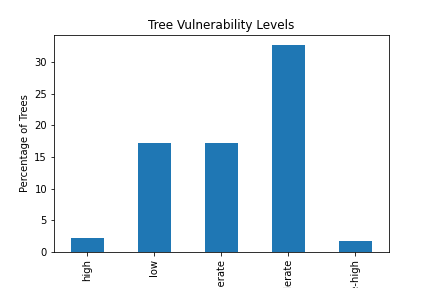
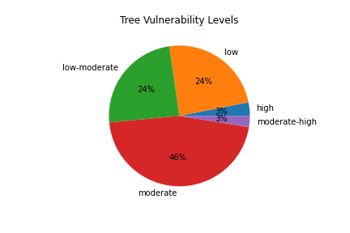

# Urban Forest Climate Change Vulnerability
This script serves to apply an estimate of Urban Forest Vulnerability to any imported inventory. Vulnerability assessments are often labor intensive and very expensive, meaning that only large communities can afford them. 

This script takes techniques from large scale assessments and applies them to any imported inventory. Tree inventories are common across small communities and this script will allow those communities to also benefit from a vulnerability assessment. 

**Please note that this script is primarily for East Coast Urban Forests.**

## Explanation
This python script analyzes a tree inventory imported by the user and compares it to an established database of tree species climate change vulnerability in order to report a summary of the inventory vulnerability (lewis et al.). 

The Script will first join the imported inventory and the vulnerability index based on the latin name of species. 
A count of successfully and unsuccessfully merged tree species will be given. This allows the user to understand what species were present in the inventory, but not in the vulnerability index. This could be due to the species not being present in the index, or a difference in spelling of the latin name. 

Next a summary of the overall vulnerability of trees present in the inventory will be generated, this includes a table summary, as well as a bar and pie chart of the percentage of the inventory in the high - low categories.  

A summary of species origins will next be generated, to indicate how many species from the inventory are native, invasive, etc. 

Finally a geopackage to create a map of the inventory will be generated for the basemap, and the individual points of each tree in the inventory, provided a latitude/longitude coordinate. 

## Files

This github contains 7 files. 
1. "output" folder: This is where all output from the script will be placed. It currently has example outputs in it. 
2. "cb_2019_us_county_500k.zip": This file containes county geographic information for the entire US. it is used to generate a baselayer for your inventory map. 
3. "import.py": This is the main python script which will conduct the analysis
4. "README.md": This file, which contains documentation for the script, and usage information. 
5. "setup.json": To be filled out by the user, allows the script to understand the structure of the imported inventory, and where it is located geographically. 
6. "SPVuln_index.csv": This is the index of species specific vulnerability, derived from (lewis et al.)
7. "Syr inventory": this is the inventory that will be imported by the script. This can be replaced with your desired inventory. 

## Instructions
**The user will need to complete a series of steps to run this script.**

### 0. Preview Results / Clear output folder
An example of the output from this script can be seen currently in this readme (below in the results section). These results can also be found in the "output" folder in this github. You can preview these to have an idea of what to expect from the script. 
> Once you are ready to conduct your own analysis, simply empty all contents of the output folder, and delete the prior inventory file in the main directory: "Syr Inventory.csv"

### 1. Fill out Json
 Fill out setup.json in a text editor, this includes the following variables which are based on the CSV and region that the inventory is from. Below features a Syracuse NY inventory as an example: 

    >"CSV":"Syr Inventory.csv",

	>"latin_name":"Sci_Name",

    >"common_name":"Common_Name",

    >"size":"DBH",
    
    >"strata":"Area",
	
    >"state_num":"36", (Based on US Census numbering)
	
    >"co_name":"Onondaga"

This JSON file allows the script to know where to search within the inventory for certain attributes. Fill out the second set of quotes with the information specific to your CSV and it's column headers.
EX: if the latin name column of your inventory is "l_name", then you would fill out: "latin_name":"l_name",

> Be sure to save the json

### 2. Save this folder
Save this github folder and all of its contents to a known location 

### 3. Place CSV
Place your inventory CSV in the same folder as the script. 

### 4. Run Script
Run the Import.py script in python

### 5. Check Readme
This readme file will automatically update with the results produced from the analysis, seen below. You may need to close the readme file before running the script. See results below:

### 6. Import Gpkg Files
This script will create a baselayer for the region of your inventory, and a point layer for each tree in the inventory. these GPKG files can be imported into QGIS or your GIS program of choice for further visual representation. 

For QGIS, below is a representation that can be created from this output. 
> 1. Create a new project
> 2. Drag in both GPKG files
> 3. Select a transformation appropriate for your region. 
> 4. Change county layer to desired color
> 5. Change tree locations layer style to "categorized" and classify based on the "Overall vulnerability" column calues. 
> 6. Sort the categories from High to Low. 
> 7. Disable "all other values" value set. 
> 7. Select "spectral" color ramp, Making high values be "hot" colors, and low values be cooler colors.
> 8. Change symbol size to 1 (depending on density of map) 
> 8. This map can then be exported at a desired zoom to best suit your inventory. 

## RESULTS:

1. Species which failed to join

Table 1: [Failed Species join](output/failed_ct.txt)

2. Overview of the count and percentage of trees within each vulnerability category

Table 2: [Vulnerability Summary](output/ov_summary.txt)

3. count of the most common ( greater than 50 occurances) tree species in your inventory, and their associated vulnerability

Table 3: [Species Overview](output/latin_sum50.txt)

4. Overview of the origin of inventory species

Table 4: [Species Origins](output/origin.txt)

### References

*Source: Lewis, D., Danielle, P. (1991). <i>CHICAGO WILDERNESS REGION URBAN FOREST VULNERABILITY ASSESSMENT AND SYNTHESIS: A Report from the Urban Forestry Climate Change Response Framework Chicago Wilderness Pilot Project</i>. www.nrs.fs.fed.us*