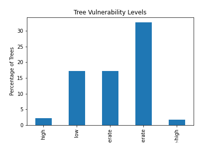

# Urban Forest Resilience
Urban Forest Resilience

This python script analyzes a tree inventory imported by the user and compares it to an established database of tree species climate change vulnerability (Brandt. Et all)
The Script will output a summary of the overall vulnerability of trees present in the inventory. 

